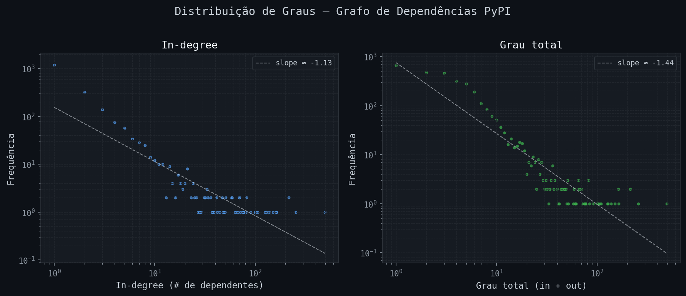
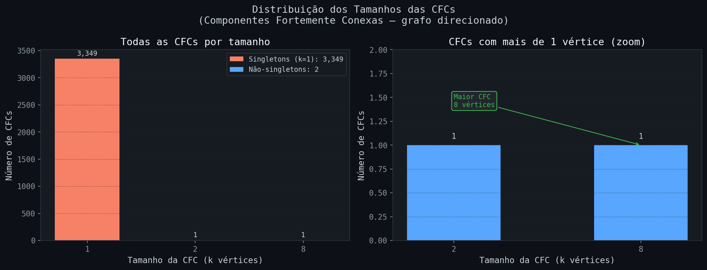
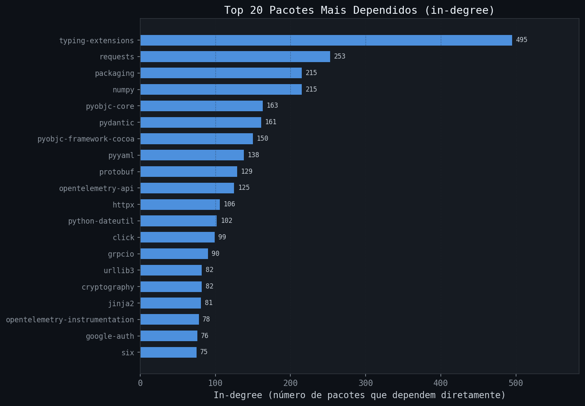

# pypi-vulnerability-graph

Análise de Resiliência e Propagação de Vulnerabilidades em Grafos de Dependências do Ecossistema Python  
**Projeto MC859 — UNICAMP, 2026**
### Aluno: Márcio Levi Sales Prado
### RA:183680

---

## Descrição

Este repositório contém os scripts de coleta, construção e análise do grafo de dependências do ecossistema PyPI, além das instâncias geradas.

O grafo é **direcionado**: uma aresta **A → B** indica que o pacote A depende de B. Os vértices representam pacotes Python e as arestas representam relações de dependência direta de runtime, extraídas da API pública do PyPI a partir dos 3.000 pacotes mais baixados nos últimos 30 dias.

---

## Instâncias (grafos)

| Arquivo | Formato | Vértices | Arestas | Download |
|---------|---------|----------|---------|----------|
| `pypi_dependency_graph.graphml` | GraphML | 3.359 | 9.662 | [graphml](data/pypi_dependency_graph.graphml) |
| `pypi_dependency_graph.gexf`    | GEXF    | 3.359 | 9.662 | [gexf](data/pypi_dependency_graph.gexf)    |

> Se os arquivos ultrapassarem 100 MB, estarão disponíveis via Git LFS ou no link alternativo indicado abaixo.

### Métricas principais

| Métrica | Valor |
|---------|-------|
| Vértices | 3.359 |
| Arestas | 9.662 |
| Grau médio | 5,75 |
| Componentes Fortemente Conexas (CFCs) | 3.351 |
| Maior CFC | 8 vértices |
| CFCs singleton | 3.349 |

---

## Estrutura do repositório

```
/
├── README.md
├── scripts/
│   ├── build_pypi_graph.py         ← coleta + construção do grafo
│   ├── analyze_pypi_graph.py       ← métricas + visualizações do grafo
│   ├── fetch_vulnerabilities.py    ← consulta OSV API e anota o grafo com CVEs
│   └── analyze_vulnerabilities.py  ← propagação de risco e figuras de vulnerabilidade
├── data/
│   ├── pypi_dependency_graph.graphml        ← instância principal
│   ├── pypi_dependency_graph.gexf           ← mesma instância, formato GEXF
│   ├── pypi_dependency_graph_vuln.graphml   ← grafo anotado com vulnerabilidades
│   ├── pypi_vulns.json                      ← mapa bruto {pacote: [vulns]}
│   ├── vuln_stats.json                      ← métricas de vulnerabilidade em JSON
│   ├── stats.json                           ← métricas do grafo em JSON
│   ├── build_log.txt                        ← log da coleta do grafo
│   └── vuln_fetch_log.txt                   ← log da coleta de vulnerabilidades
└── figures/

    ├── degree_distribution.png
    ├── scc_distribution.png
    ├── top_packages.png
    ├── vuln_risk_scores.png        ← top 20 pacotes por risco combinado
    ├── vuln_cvss_distribution.png  ← distribuição de scores CVSS
    ├── vuln_reach_vs_cvss.png      ← scatter: alcance de propagação × CVSS
    └── vuln_cascade_example.png    ← cascata do pacote mais crítico
```

---

## Visualizações

### Distribuição de graus


A distribuição segue uma lei de potência (*power-law*) em escala log-log, com expoentes −1,13 (in-degree) e −1,44 (grau total), característica de redes livres de escala (*scale-free*). Hubs como `typing-extensions` (in-degree 495) e `requests` (253) concentram a maior parte das dependências.

### Distribuição das CFCs


99,94% das CFCs são singletons, confirmando que o ecossistema PyPI é essencialmente acíclico — dependências circulares são raras. Apenas 2 CFCs possuem mais de um vértice (tamanhos 2 e 8).

### Top 20 pacotes mais dependidos


---

## Análise de Vulnerabilidades

Os scripts `fetch_vulnerabilities.py` e `analyze_vulnerabilities.py` implementam a etapa de avaliação de risco do projeto, consultando a [OSV API](https://osv.dev) para cada pacote do grafo.

### Atributos adicionados aos nós

| Atributo | Descrição |
|----------|-----------|
| `vuln_count` | Número de vulnerabilidades conhecidas |
| `vuln_ids` | IDs separados por `\|` (CVE-XXXX-XXXX, GHSA-…) |
| `max_cvss` | Maior CVSS score encontrado (0.0 se nenhum) |
| `vuln_summary` | Resumo da vulnerabilidade mais grave |

### Score de risco combinado

```
risk = CVSS × log(alcance + 1) × log(in-degree + 1)
```

Pondera gravidade × alcance de propagação (BFS reverso) × centralidade estrutural.

### Visualizações de vulnerabilidade

| Figura | Descrição |
|--------|-----------|
| `vuln_risk_scores.png` | Top 20 pacotes por risco combinado |
| `vuln_cvss_distribution.png` | Distribuição de severidade CVSS |
| `vuln_reach_vs_cvss.png` | Scatter: alcance de propagação × CVSS |
| `vuln_cascade_example.png` | Cascata BFS do pacote mais crítico |

---

## Como reproduzir

```bash
# 1) Instalar dependências
pip install networkx requests tqdm matplotlib numpy

# 2) Construir o grafo (faz requests à API pública do PyPI — ~10 min)
python scripts/build_pypi_graph.py

# 3) Analisar e gerar figuras do grafo
python scripts/analyze_pypi_graph.py

# 4) Coletar vulnerabilidades via OSV API e anotar o grafo (~5 min)
python scripts/fetch_vulnerabilities.py

# 5) Analisar propagação de risco e gerar figuras de vulnerabilidade
python scripts/analyze_vulnerabilities.py
```

Os scripts resolvem caminhos a partir da raiz do projeto, podendo ser executados diretamente de lá.

### Parâmetros configuráveis em `build_pypi_graph.py`

| Parâmetro | Padrão | Descrição |
|-----------|--------|-----------|
| `TOP_N_PACKAGES` | 3000 | Pacotes-semente do top downloads |
| `MAX_NODES` | 8000 | Limite total de nós no grafo |
| `REQUEST_DELAY` | 0.05s | Pausa entre requests (respeita rate-limit) |

### Parâmetros configuráveis em `fetch_vulnerabilities.py`

| Parâmetro | Padrão | Descrição |
|-----------|--------|-----------|
| `REQUEST_DELAY` | 0.05s | Pausa entre lotes (respeita rate-limit da OSV) |
| `MAX_RETRIES` | 3 | Tentativas em caso de falha de rede |
| `BATCH_SIZE` | 100 | Pacotes por chamada ao endpoint `/v1/querybatch` |

---

## Fonte dos dados

| Dado | Fonte |
|------|-------|
| Dependências e metadados | [API JSON do PyPI](https://pypi.org/pypi/{package}/json) |
| Lista de pacotes mais baixados | [top-pypi-packages](https://hugovk.github.io/top-pypi-packages/) |
| Vulnerabilidades | [OSV API](https://osv.dev) + [GitHub Advisory Database](https://github.com/advisories) |

---

## Autor

Márcio Levi Sales Prado — MC859, UNICAMP, 2026
