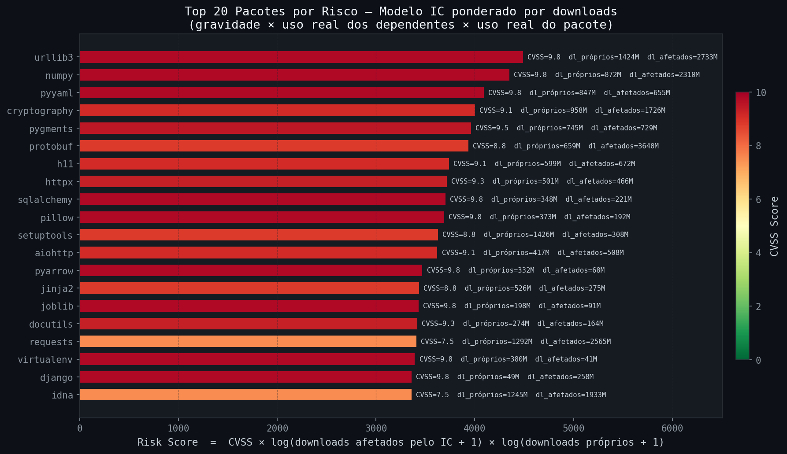
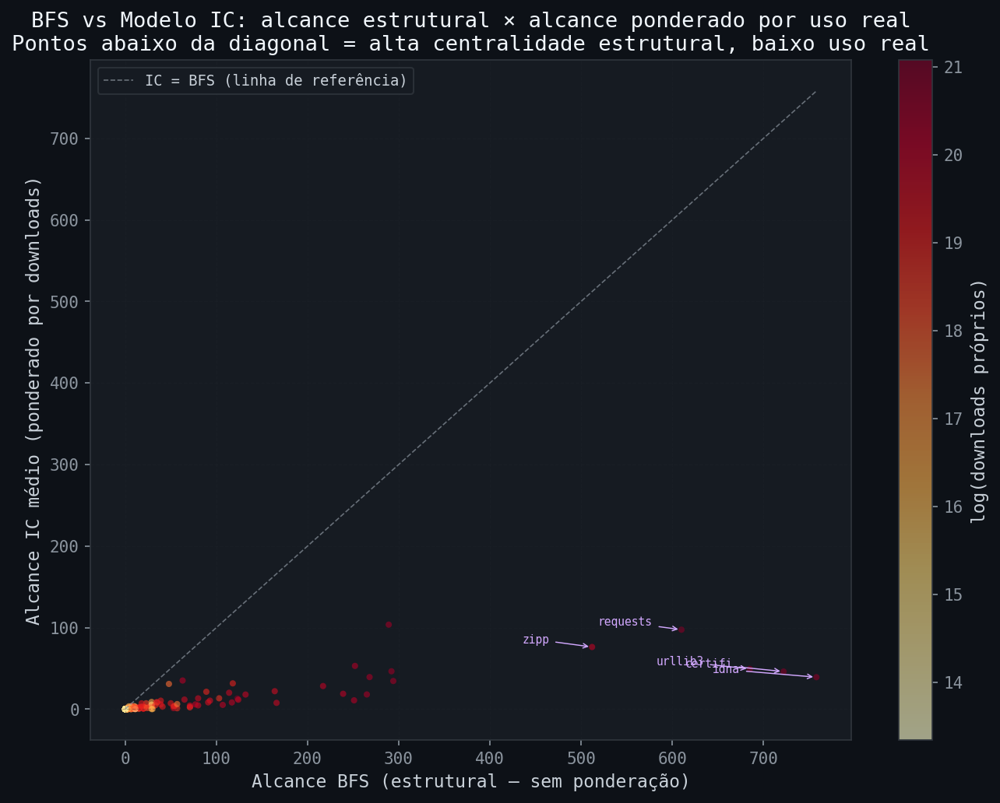

# pypi-vulnerability-graph

Análise de Resiliência e Propagação de Vulnerabilidades em Grafos de Dependências do Ecossistema Python  
**Projeto MC859 — UNICAMP, 2026**
### Aluno: Márcio Levi Sales Prado
### RA: 183680

---

## Descrição

Este repositório contém os scripts de coleta, construção e análise do grafo de dependências do ecossistema PyPI, além das instâncias geradas.

O grafo é **direcionado**: uma aresta **A → B** indica que o pacote A depende de B. Os vértices representam pacotes Python e as arestas representam relações de dependência direta de runtime, extraídas da API pública do PyPI a partir dos 3.000 pacotes mais baixados nos últimos 30 dias.

---

## Instâncias (grafos)

| Arquivo | Formato | Vértices | Arestas |
|---------|---------|----------|---------|
| [`data/pypi_dependency_graph.graphml`](data/pypi_dependency_graph.graphml) | GraphML | 3.359 | 9.659 |
| [`data/pypi_dependency_graph.gexf`](data/pypi_dependency_graph.gexf)       | GEXF    | 3.359 | 9.659 |
| [`data/pypi_dependency_graph_vuln.graphml`](data/pypi_dependency_graph_vuln.graphml) | GraphML | 3.359 | 9.659 |

> O grafo `_vuln` inclui atributos de vulnerabilidade (OSV/CVSS) e downloads mensais em cada nó.

### Métricas principais do grafo

| Métrica | Valor |
|---------|-------|
| Vértices | 3.359 |
| Arestas | 9.659 |
| Grau médio (in + out) | 5,75 |
| Componentes Fortemente Conexas (CFCs) | 3.351 |
| Maior CFC | 8 vértices |
| CFCs singleton | 3.349 |

---

## Estrutura do repositório

```
/
├── README.md
├── requirements.txt
├── scripts/
│   ├── build_pypi_graph.py         ← coleta + construção do grafo (PyPI API)
│   ├── analyze_pypi_graph.py       ← métricas + visualizações do grafo
│   ├── fetch_vulnerabilities.py    ← consulta OSV API (/v1/querybatch) e anota nós
│   ├── fix_cvss_scores.py          ← corrige CVSS usando /v1/query individual + lib cvss
│   ├── annotate_downloads.py       ← adiciona downloads mensais como atributo dos nós
│   ├── analyze_vulnerabilities.py  ← modelo IC ponderado por downloads + figuras
│   └── gerar_entrega_parcial.py    ← gera o PDF de entrega parcial (MC859)
├── data/
│   ├── pypi_dependency_graph.graphml        ← instância principal (com downloads)
│   ├── pypi_dependency_graph.gexf           ← mesma instância, formato GEXF
│   ├── pypi_dependency_graph_vuln.graphml   ← grafo anotado com CVEs + downloads
│   ├── pypi_vulns.json                      ← mapa {pacote: {vuln_count, max_cvss, …}}
│   ├── downloads_map.json                   ← mapa {pacote: downloads_mensais}
│   ├── vuln_stats.json                      ← métricas e top riscos em JSON
│   └── stats.json                           ← métricas básicas do grafo
└── assets/
    ├── degree_distribution.png
    ├── scc_distribution.png
    ├── top_packages.png
    ├── vuln_risk_scores.png         ← top 20 por risco IC + downloads
    ├── vuln_ic_vs_bfs.png           ← BFS estrutural vs alcance IC real
    ├── vuln_downloads_vs_cvss.png   ← downloads afetados × CVSS
    └── vuln_cascade_example.png     ← cascata IC do pacote mais crítico
```

---

## Visualizações

### Distribuição de graus


A distribuição segue uma lei de potência (*power-law*) em escala log-log, com expoentes −1,13 (in-degree) e −1,44 (grau total), característica de redes livres de escala (*scale-free*). Hubs como `typing-extensions` (in-degree 495) e `requests` (253) concentram a maior parte das dependências.

### Distribuição das CFCs


99,94% das CFCs são singletons, confirmando que o ecossistema PyPI é essencialmente acíclico — dependências circulares são raras. Apenas 2 CFCs possuem mais de um vértice (tamanhos 2 e 8).

### Top 20 pacotes mais dependidos


---

## Análise de Vulnerabilidades

### Atributos adicionados aos nós

| Atributo | Descrição |
|----------|-----------|
| `downloads` | Downloads mensais (fonte: top-pypi-packages) |
| `vuln_count` | Número de vulnerabilidades conhecidas (OSV) |
| `vuln_ids` | IDs separados por `\|` (CVE-XXXX-XXXX, GHSA-…) |
| `max_cvss` | Maior CVSS score numérico (extraído do vetor via lib `cvss`) |
| `vuln_summary` | Resumo da vulnerabilidade mais grave |

### Modelo de propagação — Independent Cascade (IC)

Em vez de BFS/DFS determinístico, o projeto usa o **modelo Independent Cascade** ponderado por downloads, que responde à pergunta: *"se o pacote B for comprometido, com que probabilidade o pacote A (que depende de B) será afetado?"*

A probabilidade de propagação da aresta B → A (no grafo reverso) é:

```
p(B → A) = log1p(downloads_B) / Σ log1p(downloads_dep),  para dep ∈ dependências de A
```

Interpreta-se como a fração do "peso de dependência" de A que vem de B. Pacotes pouco usados têm p pequeno, mesmo que sejam dependências de muitos outros.

### Score de criticidade

```
risk(v) = CVSS(v) × log1p(downloads_IC_afetados) × log1p(downloads_próprios)
```

- **CVSS(v)**: gravidade real da vulnerabilidade
- **downloads_IC_afetados**: média Monte Carlo (500 simulações) dos downloads dos pacotes infectados
- **downloads_próprios**: uso real do pacote no ecossistema

Esse score diferencia centralidade estrutural de impacto prático — um pacote com 1.000 dependentes mas sem uso real obtém score baixo.

### Top 5 por risco (IC + downloads)

| Pacote | CVSS | Downloads próprios | Downloads IC afetados | Risk score |
|--------|------|--------------------|----------------------|------------|
| urllib3 | 9,8 | 1,4 B | 2,6 B | 4477 |
| numpy | 9,8 | 872 M | 2,1 B | 4330 |
| pyyaml | 9,8 | 847 M | 577 M | 4064 |
| cryptography | 9,1 | 958 M | 1,7 B | 4004 |
| pygments | 9,5 | 745 M | 724 M | 3959 |

### Visualizações de vulnerabilidade

| Figura | Descrição |
|--------|-----------|
| `vuln_risk_scores.png` | Top 20 pacotes por risco IC + downloads |
| `vuln_ic_vs_bfs.png` | Comparação BFS estrutural × alcance IC real |
| `vuln_downloads_vs_cvss.png` | Downloads afetados pelo IC × CVSS |
| `vuln_cascade_example.png` | Cascata IC do pacote mais crítico (urllib3) |





---

## Como reproduzir

```bash
# 1) Instalar dependências
pip install networkx requests tqdm matplotlib numpy cvss

# 2) Construir o grafo (requests à API pública do PyPI — ~10 min)
python scripts/build_pypi_graph.py

# 3) Analisar e gerar figuras do grafo
python scripts/analyze_pypi_graph.py

# 4) Coletar vulnerabilidades via OSV API (batch)
python scripts/fetch_vulnerabilities.py

# 5) Corrigir CVSS scores com endpoint individual + biblioteca cvss
python scripts/fix_cvss_scores.py

# 6) Anotar nós com downloads mensais
python scripts/annotate_downloads.py

# 7) Modelo IC + figuras de risco ponderado por downloads
python scripts/analyze_vulnerabilities.py
```

---

## Fonte dos dados

| Dado | Fonte |
|------|-------|
| Dependências e metadados | [API JSON do PyPI](https://pypi.org/pypi/{package}/json) |
| Lista de pacotes + downloads | [top-pypi-packages](https://hugovk.github.io/top-pypi-packages/) |
| Vulnerabilidades e CVSS | [OSV API](https://api.osv.dev) + [GitHub Advisory Database](https://github.com/advisories) |

---

## Autor

Márcio Levi Sales Prado — MC859, UNICAMP, 2026
