# pypi-vulnerability-graph

Análise de Resiliência e Propagação de Vulnerabilidades em Grafos de Dependências do Ecossistema Python  
**Projeto MC859 — UNICAMP, 2026**
### Aluno: Márcio Levi Sales Prado
### RA: 183680

---

## Descrição

Este repositório contém os scripts de coleta, construção e análise do grafo de dependências do ecossistema PyPI, além das instâncias geradas.

O grafo é **direcionado**: uma aresta **A → B** indica que o pacote A depende de B. Os vértices representam pacotes Python e as arestas representam relações de dependência direta de runtime, extraídas da API pública do PyPI a partir de duas fontes combinadas: os 8.000 pacotes mais baixados nos últimos 30 dias (sementes prioritárias) e 40.000 pacotes adicionais do **PyPI Simple Index**, todos expandidos por BFS via dependências transitivas.

---

## Instâncias (grafos)

| Arquivo | Formato | Vértices | Arestas |
|---------|---------|----------|---------|
| [`data/pypi_dependency_graph.graphml`](data/pypi_dependency_graph.graphml) | GraphML | 54.406 | 178.193 |
| [`data/pypi_dependency_graph.gexf`](data/pypi_dependency_graph.gexf)       | GEXF    | 54.406 | 178.193 |
| [`data/pypi_dependency_graph_vuln.graphml`](data/pypi_dependency_graph_vuln.graphml) | GraphML | 54.406 | 178.193 |

> O grafo `_vuln` inclui atributos de vulnerabilidade (OSV/CVSS) e downloads mensais em cada nó.

### Métricas principais do grafo

| Métrica | Valor |
|---------|-------|
| Vértices | 54.406 |
| Arestas | 178.193 |
| Grau médio (in + out) | 6,55 |
| In-degree máximo | 6.479 (`numpy`) |
| Out-degree máximo | 1.000 |
| Componentes Fortemente Conexas (CFCs) | 54.298 |
| Maior CFC | 11 vértices |
| CFCs singleton | 54.238 (99,89%) |
| Componentes Fracamente Conexas (CCFs) | 14.003 |
| Maior CCF | 40.105 vértices |

---

## Estrutura do repositório

```
/
├── README.md
├── requirements.txt
├── Entrega_Parcial_MC859.pdf       ← entrega parcial MC859 (4 páginas)
├── Relatório final de MC859.odt    ← relatório final (15 páginas)
├── relatorio/                      ← pseudocódigo LaTeX dos algoritmos
├── scripts/
│   ├── build_pypi_graph.py         ← coleta + construção do grafo (PyPI API)
│   ├── analyze_pypi_graph.py       ← métricas + visualizações do grafo
│   ├── fetch_vulnerabilities.py    ← consulta OSV API (/v1/querybatch) e anota nós
│   ├── fix_cvss_scores.py          ← corrige CVSS usando /v1/query individual + lib cvss
│   ├── annotate_downloads.py       ← adiciona downloads mensais como atributo dos nós
│   ├── analyze_vulnerabilities.py  ← modelo IC ponderado por downloads + figuras
│   ├── detect_communities.py       ← detecção de comunidades (Louvain) + figuras
│   ├── validate_model.py           ← validação Precision@K/Recall@K + Spearman
│   └── gerar_entrega_parcial.py    ← gera o PDF de entrega parcial (MC859)
├── data/
│   ├── pypi_dependency_graph.graphml        ← instância principal (com downloads)
│   ├── pypi_dependency_graph.gexf           ← mesma instância, formato GEXF
│   ├── pypi_dependency_graph_vuln.graphml   ← grafo anotado com CVEs + downloads
│   ├── pypi_dependency_graph_communities.graphml ← grafo anotado com comunidades
│   ├── community_stats.json                 ← métricas e top comunidades de risco
│   ├── validation_stats.json                ← métricas de validação do modelo
│   ├── pypi_vulns.json                      ← mapa {pacote: {vuln_count, max_cvss, …}}
│   ├── downloads_map.json                   ← mapa {pacote: downloads_mensais}
│   ├── vuln_stats.json                      ← métricas e top riscos em JSON
│   ├── stats.json                           ← métricas básicas do grafo
│   ├── build_log.txt                        ← log da coleta do grafo (gerado)
│   └── vuln_fetch_log.txt                   ← log da coleta OSV (gerado)
└── assets/                         ← todas as figuras geradas pelos scripts
    ├── degree_distribution.png
    ├── scc_distribution.png
    ├── top_packages.png
    ├── vuln_risk_scores.png         ← top 20 por risco IC + downloads
    ├── vuln_ic_vs_bfs.png           ← BFS estrutural vs alcance IC real
    ├── vuln_downloads_vs_cvss.png   ← downloads afetados × CVSS
    ├── vuln_cascade_example.png     ← cascata IC do pacote mais crítico
    ├── communities_size_distribution.png  ← distribuição de tamanho das comunidades
    ├── communities_risk.png               ← comunidades de maior risco agregado
    ├── communities_network.png            ← visão da rede de comunidades
    ├── validation_precision_at_k.png      ← Precision@K / Recall@K
    └── validation_correlation.png         ← correlações de Spearman
```

---

## Visualizações

### Distribuição de graus
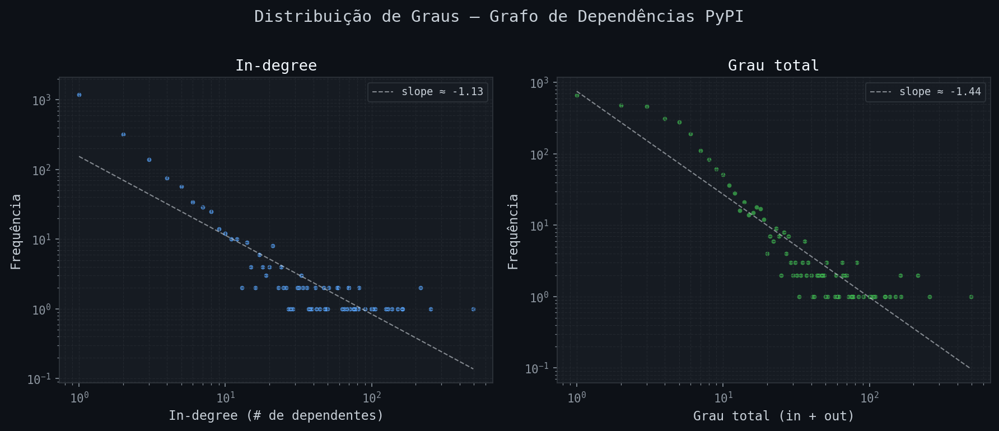

A distribuição segue uma lei de potência (*power-law*) em escala log-log, com expoentes −0,91 (in-degree) e −1,20 (grau total), característica de redes livres de escala (*scale-free*). Hubs como `numpy` (in-degree 6.479), `requests` (6.463) e `pydantic` (4.461) concentram a maior parte das dependências.

### Distribuição das CFCs
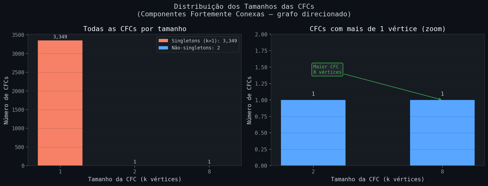

99,89% das CFCs são singletons, confirmando que o ecossistema PyPI é essencialmente acíclico — dependências circulares são raras. Apenas 60 CFCs possuem mais de um vértice, com tamanhos entre 2 e 11.

### Top 20 pacotes mais dependidos
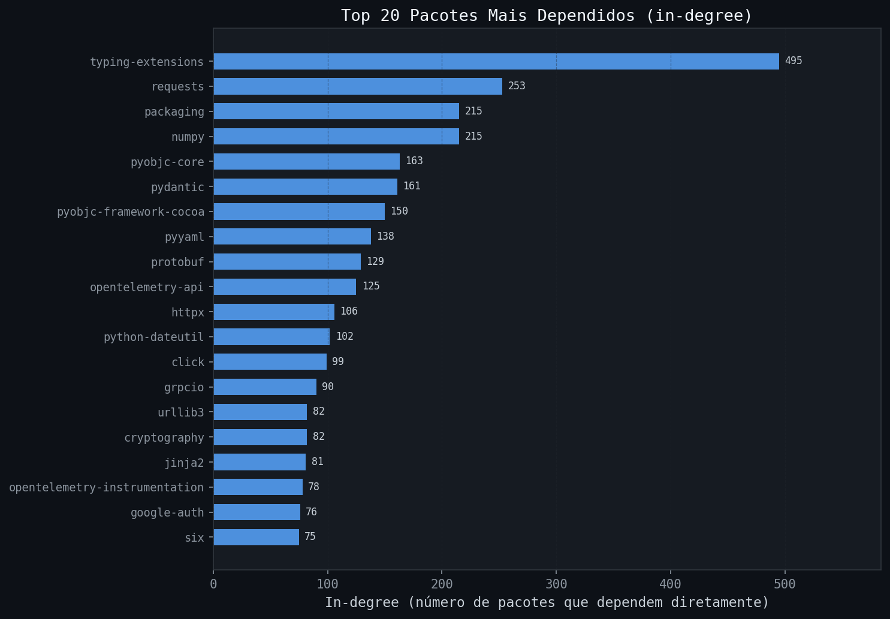

---

## Análise de Vulnerabilidades

### Atributos adicionados aos nós

| Atributo | Descrição |
|----------|-----------|
| `downloads` | Downloads mensais (fonte: top-pypi-packages) |
| `vuln_count` | Número de vulnerabilidades conhecidas (OSV) |
| `vuln_ids` | IDs separados por `\|` (CVE-XXXX-XXXX, GHSA-…) |
| `max_cvss` | Maior CVSS score numérico (extraído do vetor via lib `cvss`) |
| `vuln_summary` | Resumo da vulnerabilidade mais grave |

### Modelo de propagação — Independent Cascade (IC)

Em vez de BFS/DFS determinístico, o projeto usa o **modelo Independent Cascade** ponderado por downloads, que responde à pergunta: *"se o pacote B for comprometido, com que probabilidade o pacote A (que depende de B) será afetado?"*

A probabilidade de propagação da aresta B → A (no grafo reverso) é:

```
p(B → A) = log1p(downloads_B) / Σ log1p(downloads_dep),  para dep ∈ dependências de A
```

Interpreta-se como a fração do "peso de dependência" de A que vem de B. Pacotes pouco usados têm p pequeno, mesmo que sejam dependências de muitos outros.

### Score de criticidade

```
risk(v) = CVSS(v) × log1p(downloads_IC_afetados) × log1p(downloads_próprios)
```

- **CVSS(v)**: gravidade real da vulnerabilidade
- **downloads_IC_afetados**: média Monte Carlo (500 simulações) dos downloads dos pacotes infectados
- **downloads_próprios**: uso real do pacote no ecossistema

Esse score diferencia centralidade estrutural de impacto prático — um pacote com 1.000 dependentes mas sem uso real obtém score baixo.

### Top 5 por risco (IC + downloads)

| Pacote | CVSS | Downloads próprios | Downloads IC afetados | Risk score |
|--------|------|--------------------|----------------------|------------|
| urllib3 | 9,8 | 1,42 B | 2,73 B | 4488 |
| numpy | 9,8 | 872 M | 2,31 B | 4350 |
| pyyaml | 9,8 | 847 M | 655 M | 4090 |
| cryptography | 9,1 | 958 M | 1,73 B | 4003 |
| pygments | 9,5 | 745 M | 729 M | 3960 |

> Total de pacotes com ao menos 1 CVE: **648 de 54.406 (1,2%)**

### Visualizações de vulnerabilidade

| Figura | Descrição |
|--------|-----------|
| `vuln_risk_scores.png` | Top 20 pacotes por risco IC + downloads |
| `vuln_ic_vs_bfs.png` | Comparação BFS estrutural × alcance IC real |
| `vuln_downloads_vs_cvss.png` | Downloads afetados pelo IC × CVSS |
| `vuln_cascade_example.png` | Cascata IC do pacote mais crítico (urllib3) |

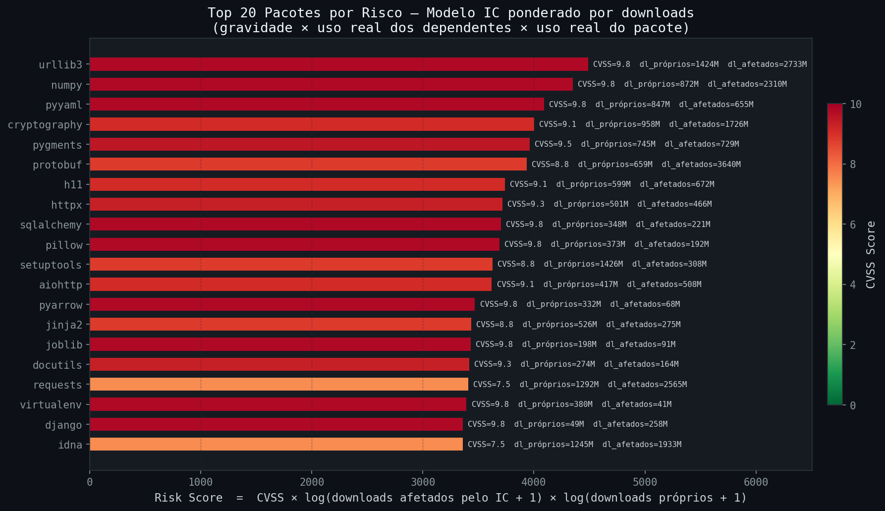

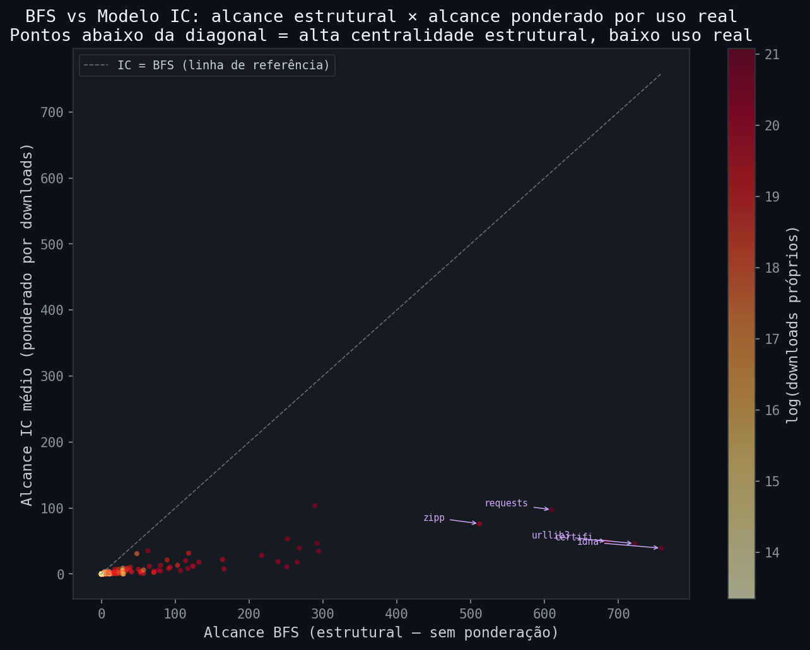

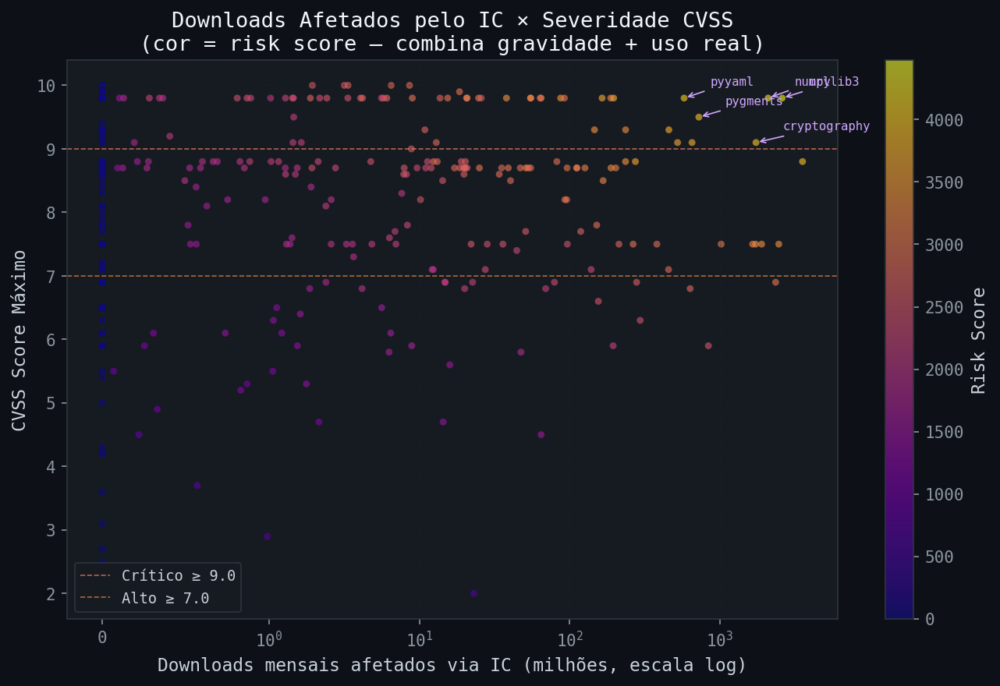

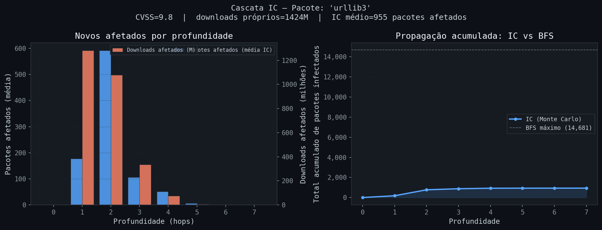

---

## Detecção de Comunidades

O grafo (não-direcionado para esta etapa) foi particionado com o algoritmo de **Louvain**, encontrando **63 comunidades** com modularidade **Q = 0,50** — valor que indica estrutura comunitária forte e bem definida.

**Tamanhos:** maior comunidade = 7.749 pacotes; menor = 3; mediana = 16; média ≈ 637.

### Comunidades de maior risco agregado

Fração de pacotes vulneráveis dentro da comunidade:

| Comunidade | Tema | Pacotes | % vulneráveis |
|------------|------|---------|---------------|
| 28 | ERP Tryton | 32 | 9,4% |
| 9 | Zope / Plone / setuptools | 41 | 56,3% |
| 11 | jsonschema / Ansible / OpenStack | 481 | 4,2% |
| 0 | Web / base (urllib3, flask) | 5.062 | 3,3% (167 vulneráveis) |
| 32 | Dados / Airflow | 1.090 | 3,1% |

### Visualizações de comunidades

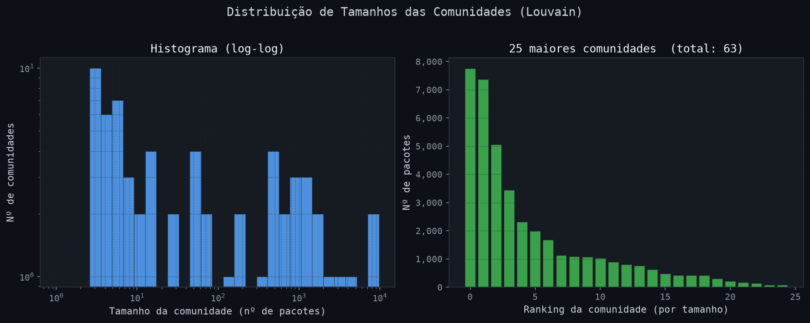

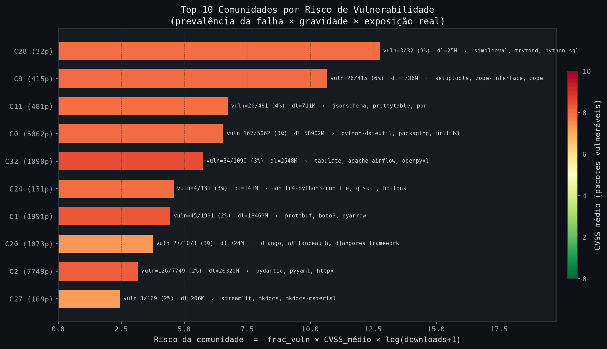

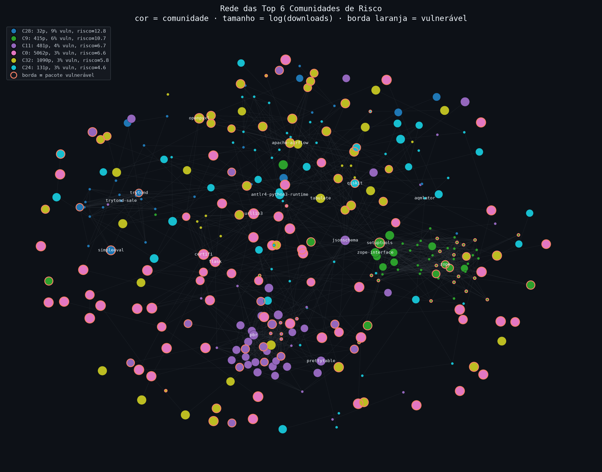

---

## Validação do Modelo

O ranking de risco foi validado contra um conjunto de **13 pacotes ground-truth** (pacotes com CVEs notórias e de alto impacto conhecido). Todos os 13 foram recuperados no top-50 (**Recall@50 = 1,0**).

### Precision@K / Recall@K

| K | Precision@K | Recall@K |
|---|-------------|----------|
| 10 | 0,50 | 0,38 |
| 20 | 0,45 | 0,69 |
| 50 | 0,26 | 1,00 |

### Correlações de Spearman do risk score

- vs. downloads próprios: **ρ = +0,55** (p ≈ 3×10⁻⁵)
- vs. downloads afetados pelo IC: **ρ = +0,59**
- vs. CVSS: **ρ = +0,28** (p ≈ 0,05)

Indica que o score é guiado principalmente pelo alcance real de uso, não apenas pela gravidade isolada.

**Estudos de caso:** `urllib3` (rank 1), `pyyaml` (rank 3), `requests` (rank 17) — todos com grande alcance estrutural (BFS reverso de 13–15 mil pacotes).

### Visualizações de validação

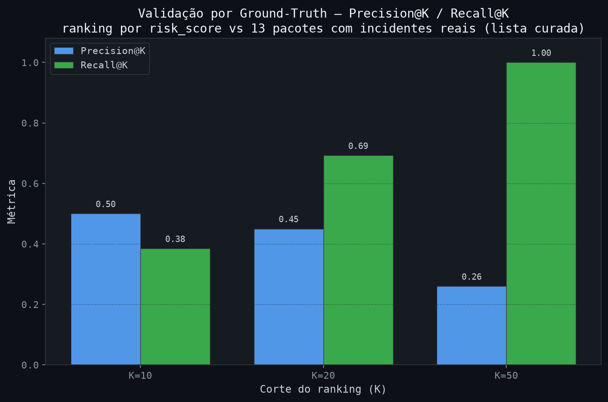

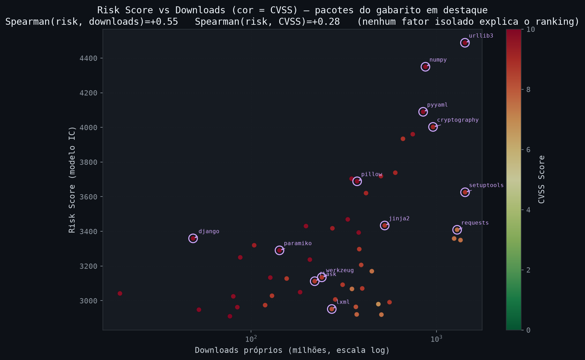

---

## Como reproduzir

```bash
# 1) Instalar dependências
pip install -r requirements.txt

# 2) Construir o grafo (requests à API pública do PyPI — ~30 min para 54k nós)
python scripts/build_pypi_graph.py

# 3) Analisar e gerar figuras do grafo
python scripts/analyze_pypi_graph.py

# 4) Coletar vulnerabilidades via OSV API (batch)
python scripts/fetch_vulnerabilities.py

# 5) Corrigir CVSS scores com endpoint individual + biblioteca cvss
python scripts/fix_cvss_scores.py

# 6) Anotar nós com downloads mensais
python scripts/annotate_downloads.py

# 7) Modelo IC + figuras de risco ponderado por downloads
python scripts/analyze_vulnerabilities.py

# 8) Gerar PDF de entrega parcial (4 páginas)
python scripts/gerar_entrega_parcial.py

# 9) Detecção de comunidades (Louvain) + figuras
python scripts/detect_communities.py

# 10) Validação do modelo (Precision@K/Recall@K + Spearman)
python scripts/validate_model.py
```

> Os passos 9 e 10 exigem as bibliotecas `python-louvain` (importada como `community`) e `scipy` no `requirements.txt`.

---

## Fonte dos dados

| Dado | Fonte |
|------|-------|
| Dependências e metadados | [API JSON do PyPI](https://pypi.org/pypi/{package}/json) |
| Lista de pacotes + downloads | [top-pypi-packages](https://hugovk.github.io/top-pypi-packages/) |
| Vulnerabilidades e CVSS | [OSV API](https://api.osv.dev) + [GitHub Advisory Database](https://github.com/advisories) |

---

## Autor

Márcio Levi Sales Prado — MC859, UNICAMP, 2026
